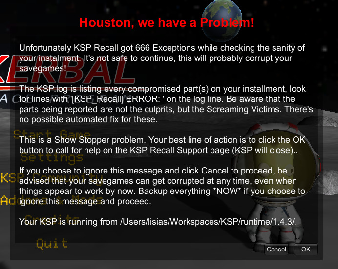
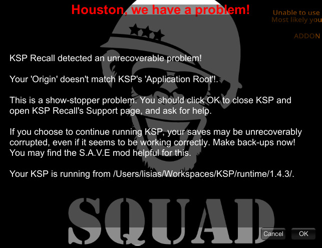
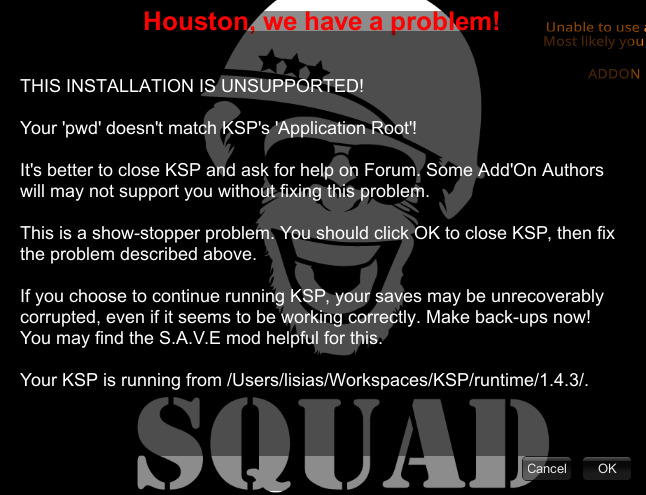

# KSP-Recall :: Support Page

Ouch...

So KSP-Recall decided to pesky you about errors and you are at lost? Well, usually there's a reason for that, and this page will try to help you on solving it - or at least pinpoint you to a place where someone (usually me) will be able to help you!


## ShowStopperAlertBox

If you got this Dialog from KSP-Recall:



Then something really serious happened, and there's little to no chance that you can solve it by yourself - unless you are an experienced user (or developer!).

The best thing you can do by now is to click "OK", that will so close KSP and open this very page you are reading now (so chances are that you did exactly that!).

See the bottom of this page for links about where to reach me for help!
 

## FatalAlertBox

### "Your 'Origin' doesn't match KSP's 'Application Root'!"

I you got an error with the message above, this is what you probably was seeing before clicking the "OK" button:



Again, the best thing to do is to click "OK", that will so close KSP and open this very page you are reading now.

In order to understand what's happening, I need to explain two things to you:

* What's `Application Root`?
* What's `Origin`?

A game needs to install a lot of files in your HDD (or SDD), and then it (and all your add'ons) need to find them somehow on code.

`Application Root` is where KSP itself is telling us where it is installed.

`Origin` is where KSPe (a component KSP-Recall relies on) is telling KSP-Recall where the game is installed.

This is an example:

```
[LOG 05:30:41.839] [KSPe] origin:                     C:\Program Files (x86)\Steam\steamapps\common\Kerbal Space Program\
[LOG 05:30:41.839] [KSPe] KSPUtil.ApplicationRootPath C:/Program Files (x86)/Steam/steamapps/common/Kerbal Space Program/KSP_x64_Data/../
```

Both **need to match** (after being *normalised*, of course), otherwise something **really, really wrong** is happening and I really, really need to know about. Reach me using one of the links on the bottom of this page and I will help.

### "Your 'pwd' doesn't match KSP's 'Application Root'!" or "Your 'pwd' doesn't match KSP's 'Origin'!"

I you got an error with the message above, this is what you probably was seeing before clicking the "OK" button:



That's the history: besides the place where you installed the game (see previous section about `Origin` and `Application Root`), every Operating System also have something called `program working directory`, `current working directory` or `default directory` (depending of the O.S. you are using). For simplicity, let's call this thingy `pwd` and call it a day.

**Usually** on Windows, the `pwd` must be set on the same place the program is installed, but on Linux and MacOS this is not necessarily the true - on UNIX (and Linux and MacOS are a kind of UNIX), you can run the program from one place and have the `pwd` set in another, and so you don't need to tell the program every time where you want it to find the relevant data files. 

People using old school Graphical Shells as OpenSTEP are used to this.

KSP, however, was born as a Windows application, and so the `pwd` is set to the same place where the `KSP.exe`, `KSP_x64` or `KSP.app` executable is.

Problem: if by some reason the GUI (or some Launcher, as Steam) sets it wrongly, **KSP will misbehave**. Some files will be place on the wrong directory, some add'ons will not work as intended, you name it.

This was a [marginal problem detected on KSPe](https://github.com/net-lisias-ksp/KSPe/issues/9) some years ago, but recently KSP 1.12.4 started to deploy a thingy called `PD Launcher` on Steam Launcher that pissed of some users and they decided to get rid it.

These are the attempts I got notice until the moment:

* [Forums's Attempt](https://forum.kerbalspaceprogram.com/index.php?/topic/210409-how-to-bypass-the-new-launcher-added-in-update-1124-steam/)
* [Reddit's Workaround for the problem on the previous link](https://www.reddit.com/r/KerbalSpaceProgram/comments/ym04gx/solution_for_broken_mods_caused_by_the_launcher/)

Both of them **are wrong**.

By using the work around from the Forum, the `pwd` gets screwed on launching the game and, so, the problems I described above happens.

This is how things are probably setup now on your Windows in order to get things screwed as they are now:

```
[LOG 05:30:41.839] [KSPe] pwd:                        C:\Program Files (x86)\Steam\steamapps\common\Kerbal Space Program\PDLauncher\
[LOG 05:30:41.839] [KSPe] origin:                     C:\Program Files (x86)\Steam\steamapps\common\Kerbal Space Program\
[LOG 05:30:41.839] [KSPe] KSPUtil.ApplicationRootPath C:/Program Files (x86)/Steam/steamapps/common/Kerbal Space Program/KSP_x64_Data/../
```

And this is how it should be instead in order to get things working tight:

```
[LOG 05:30:41.839] [KSPe] pwd:                        C:\Program Files (x86)\Steam\steamapps\common\Kerbal Space Program\
[LOG 05:30:41.839] [KSPe] origin:                     C:\Program Files (x86)\Steam\steamapps\common\Kerbal Space Program\
[LOG 05:30:41.839] [KSPe] KSPUtil.ApplicationRootPath C:/Program Files (x86)/Steam/steamapps/common/Kerbal Space Program/KSP_x64_Data/../
```

Can you see the difference?

The workaround from Reddit tries to fix things in a terrible way, as everything now is duplicated inside KSP and things gets really, really messy. And, yeah, KSP-Recall (and some others add'ons of mine, as TweakScale) complained even more as they are finding themselves on the wrong place - yeah, I check **everything** before running!! :) 

Your best option, by a mile, is to **bluntly replace** `PD Launcher` with `KSSL`, a quick & dirty launcher that works fine with Steam Launcher and KSP and don't have any of the complications `PD Launcher` brought to some users.

[Check the Forum for it](https://forum.kerbalspaceprogram.com/index.php?/topic/210467-kssl-ksp-simple-steam-launcher/#comment-4197684).

Remember to restore the Steam Launcher command line to what it was before.

If even by replaceing `PD Launcher` with `KSSL` you still get this message, reach me using the links on the bottom of this page and I will help.


## Where to reach me

You can reach me for help on the following links:

* [Github Discussions](https://github.com/net-lisias-ksp/KSP-Recall/discussions/48)
	+ May be convenient if you have a github account and not a Forum one.
	+ **Mention my name using `@Lisias`** or I may take some time until I detected your post!
* [Forum](https://forum.kerbalspaceprogram.com/index.php?/topic/192048-*)
	+ If you don't have a github account, then your best option is really the Forum. I usually check it (almost) every day - but now and then Real life™ bites and I may take 2 or 3 days to respond.

In any case, you really will need to send me your `KSP.log` file, that you will find on the same directory where your `KSP.exe`, `KSP.app` or `KSP_x64` executable file is.
